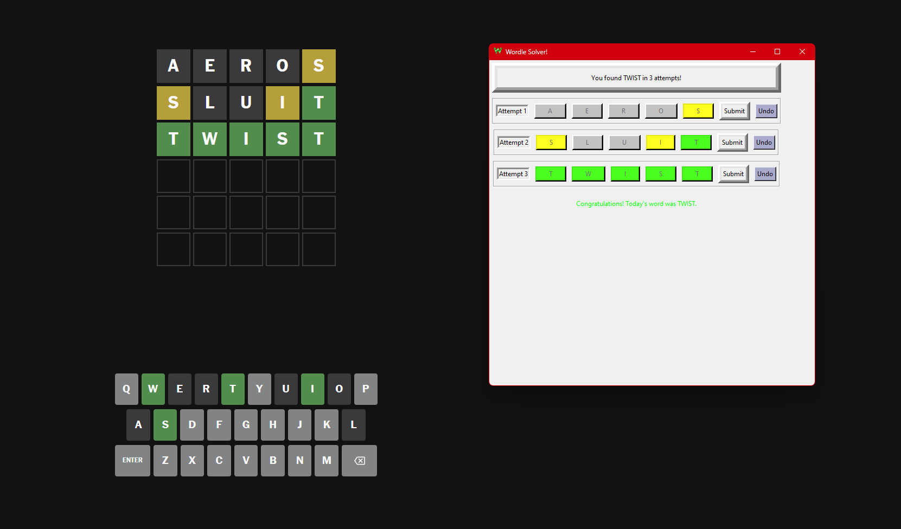

# Wordle Solver and Game Assistant

This project offers a **Wordle Solver** written in Python, featuring a **powerful backend engine** for word evaluation and filtering, along with a **user-friendly graphical interface** built with Tkinter. Whether you’re solving puzzles or refining your Wordle strategies, this tool provides word suggestions and dynamic feedback to improve your gameplay.




---

## Features

### Backend Logic
- **Accurate Word Filtering:** Filters word possibilities based on Wordle feedback (gray, yellow, and green rules).
- **Optimal Word Suggestions:** Uses character frequency analysis to recommend the most informative next guess.
- **Customizable Dictionary:** Reads from a dictionary file for flexible wordlists.
- **Robust Validation:** Ensures all guesses are valid and dictionary-compliant.

### Graphical Interface
- **Interactive Gameplay:** Type guesses directly and receive real-time suggestions.
- **Dynamic Color Coding:** Displays Wordle feedback via intuitive button color changes (gray, yellow, green).
- **Automatic Word Suggestions:** Suggests the best guess based on remaining word possibilities.
- **Progress Tracking:** Manages up to 6 attempts with clear visual feedback for each stage.

---

## Installation

1. **Clone the Repository**:
   ```bash
   git clone https://github.com/CFMVCarlos/WordleSolver.git
   cd WordleSolver
   ```

2. **Install Dependencies**:
   Install Python dependencies:
   ```bash
   pip install -r requirements.txt
   ```
   *This project primarily relies on Python's built-in libraries.*

3. **Set Up the Dictionary**:
   Download or create a dictionary file (`CSW19.txt`) containing one word per line in lowercase. Place the file in the project directory.

---

## How to Run

### Graphical Interface (GUI)
Launch the interactive Tkinter interface:
```bash
python wordleSolverFrontend.py
```

---

## Usage

### Backend Logic
- Use `processWordleAttempt()` to evaluate guesses.
- Call `selectWord()` to generate the best next guess.

### Graphical Interface
1. Enter your first guess via the keyboard.
2. Click letters to mark them:
   - **Gray:** Excluded (not in the word).
   - **Yellow:** In the word, wrong position.
   - **Green:** Correct position.
3. Press **Submit** to process your guess.
4. Follow suggestions or refine guesses manually.

---

## Project Structure

```
WordleSolver/
├── wordleSolverBackend.py   # Core logic for solving puzzles
├── wordleSolverFrontend.py  # Tkinter-based graphical interface
├── CSW19.txt                # Word dictionary file (user-provided)
├── requirements.txt         # Dependency list (if any)
└── README.md                # Documentation
```

---

## Key Functions

### Backend Core Functions
- **`processWordleAttempt(word)`**: Evaluates a guess using Wordle rules.
- **`selectWord(look_duplicate=False)`**: Suggests the most promising next guess.
- **`removeGray(char, index, softRemove=False)`**: Eliminates words containing invalid characters.
- **`removeYellow(char, index)`**: Ensures valid words include characters in incorrect positions.
- **`removeGreen(char, index)`**: Keeps words matching characters at correct positions.
- **`isInDictionary(word)`**: Validates if a word exists in the dictionary.
- **`wordsLeft()`**: Outputs the count of remaining valid words.

### Frontend Features
- **Keyboard Input**: Type guesses or use backspace to edit.
- **Letter Feedback**: Click buttons to toggle between feedback states (gray, yellow, green).
- **Word Submission**: Validates and processes guesses.
- **Undo Functionality**: Allows users to revert their last action.
- **Visual Feedback**: Updates the interface dynamically with game progress.

---

## Future Improvements

- Add support for Wordle variants in other languages.
- Implement additional validation for dictionary entries.
- Enhance accessibility features for a broader audience.
- Improve performance for large dictionaries.

---

## Contributing

Contributions are welcome! Fork this repository and submit a pull request with your enhancements or fixes. Whether you're refining the logic or adding new features, your input is valued.

---

## License

This project is licensed under the **MIT License**. For more details, see the `LICENSE` file.

---

## Author

- [Carlos Valente](https://github.com/CFMVCarlos)